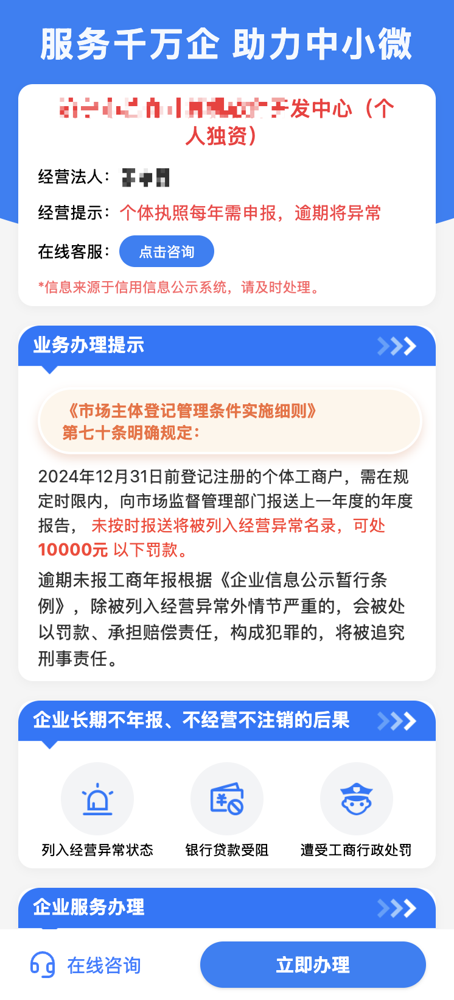
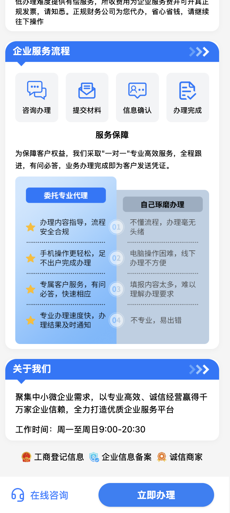

# 企业服务平台 —— 助力企业数字化，专属定制开发与维护

本仓库仅用于展示企业服务平台相关介绍与服务内容，仓库本身不包含可运行代码。如需定制开发、技术服务或咨询，请查看： [联系我们](#联系我们)

本平台为B端企业客户提供平台二次开发、定制化功能开发与长期技术运维服务，助力企业数字化升级，合规高效发展。

## 预览

## 我们能为B端客户做什么？

- **专属定制开发**：根据企业实际业务需求，深度定制功能模块、界面风格、业务流程，打造专属企业服务平台。
- **系统集成与对接**：支持与企业现有系统（如OA、ERP、财务等）无缝集成，提升信息流转效率。
- **持续技术维护**：提供长期技术支持、系统升级、故障响应，保障平台稳定运行。
- **合规与安全保障**：严格遵循数据安全与合规要求，助力企业无忧经营。
- **专属顾问服务**：配备资深项目经理与开发团队，全流程对接，确保项目高效落地。

## 适用场景

- 企业希望拥有专属的工商服务平台，提升服务数字化水平
- 需要将平台与企业内部系统集成，实现数据互通
- 对平台功能、界面、流程有个性化定制需求
- 需要长期技术运维和升级保障

## 合作流程

1. 需求沟通与方案定制
2. 签署合作协议
3. 专属团队开发与交付
4. 上线部署与培训
5. 持续维护与升级

---

> 让企业服务平台成为您的专属数字化助手，助力企业高效合规发展。欢迎咨询合作，获取专属定制方案！

---

## 技术架构（为IT负责人/合作方参考）

- 前端框架：Vue 3
- 路由管理：vue-router
- 组件库：自定义组件 + Tailwind CSS 原子化样式
- 状态管理：Pinia（@ethan-utils/pinia）
- 工具库：@vueuse/core
- 构建工具：Vite
- 代码规范：ESLint、Prettier、Oxlint

## 联系我们

- 工作时间：周一至周日 9:00-20:30
- 平台支持在线客服咨询
- 欢迎企业合作与定制需求洽谈
- 微信：digitalNomad2006 | 131-9876-3535
